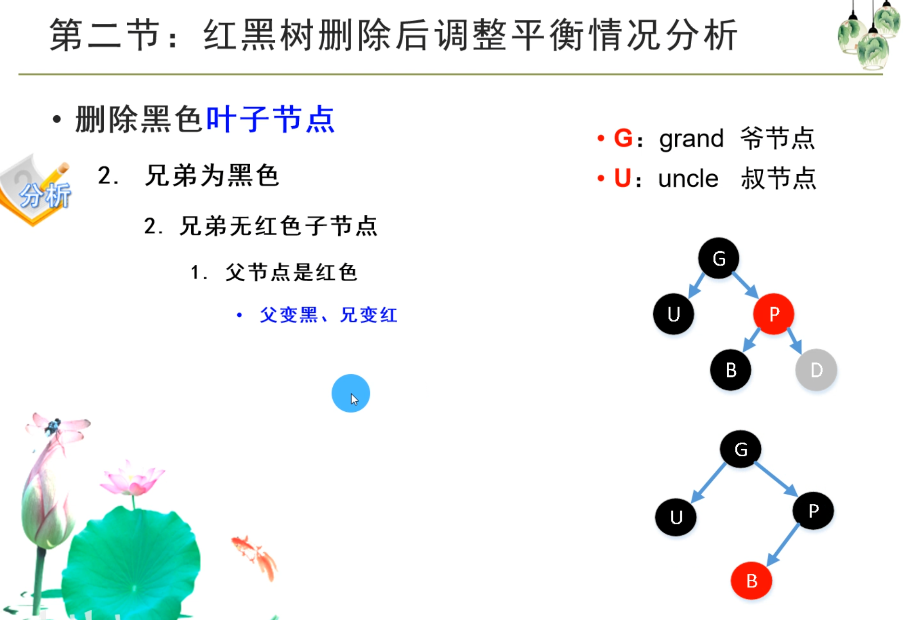

 

只有三种情况：

1. 一个单独的黑色节点就是一个B树2节点
2. 一个黑色节点和一个红色子节点，构成一个B树3节点，可以左倾也可以右倾
3. 一个黑色节点和两个红色子节点，构成一个B树4节点

#### 左倾：

右倾：

#### 默认新增节点的颜色为红色

#### 新增节点时，只有两种情况需要调整：

#### 1.  3-节点的添加，无叔节点或叔节点为黑色

#### 2.  4-节点的添加，有叔节点且为红色

#### 红黑树删除

​		**对于第3种情况，以删除节点10为例，前驱节点为黑色节点4，后继节点为黑色节点12。如果删除4，调整较多，而如果删除12，可以转化为情况2，此时调整较少。所以对于情况三，调整策略为：先找前驱节点，判断是否为情况2，如果不是的话，再找后继节点，判断是否为情况2，如果都不满足情况2，就用后继。**

**其实只用前驱或者只用后继都可以，但这不失为一个可以优化调整的方法。**

**比如删除节点50**

**前驱节点为45，45是有一个红色叶子节点的黑节点，将45作为50的替代节点，操作步骤为：将50变为45，将45变为42，然后删除红色叶子节点42。**

**而后继节点为60，是一个黑色的叶子节点，将50变为60，然后再删除黑色叶子节点60，此时以80为根节点的子树黑高就不平衡了，比较麻烦。**

**删除节点时，通过转化，只有两种情况：删除红色叶子节点和删除黑色叶子节点。只有一种情况需要调整，即删除的是黑色叶子节点。**

**如果兄弟有两个红色子节点，当作LL型处理即可**

**对于情况2.2.2，只是把父节点当作要删除的节点进行递归调整，并不真的删除**

**具体操作为：**

**这里还是以删除黑色右叶子节点D为例，它的左兄弟B为红，先将兄弟B和右侄NR颜色互换，然后右旋父节点P**

